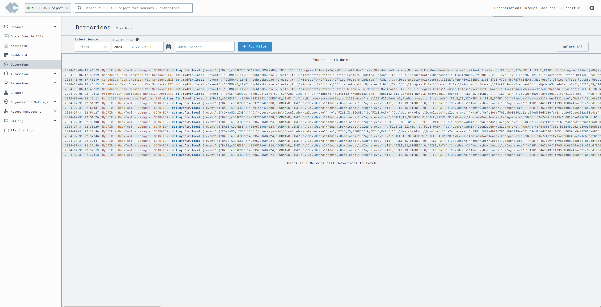
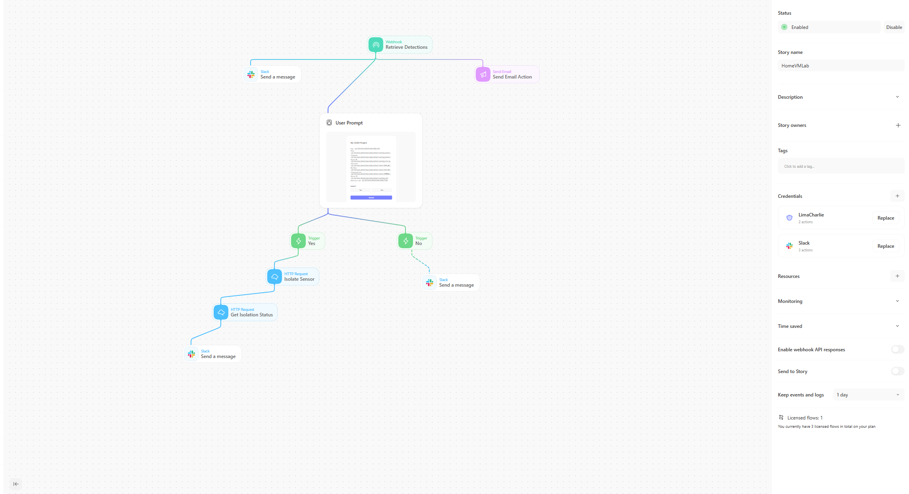
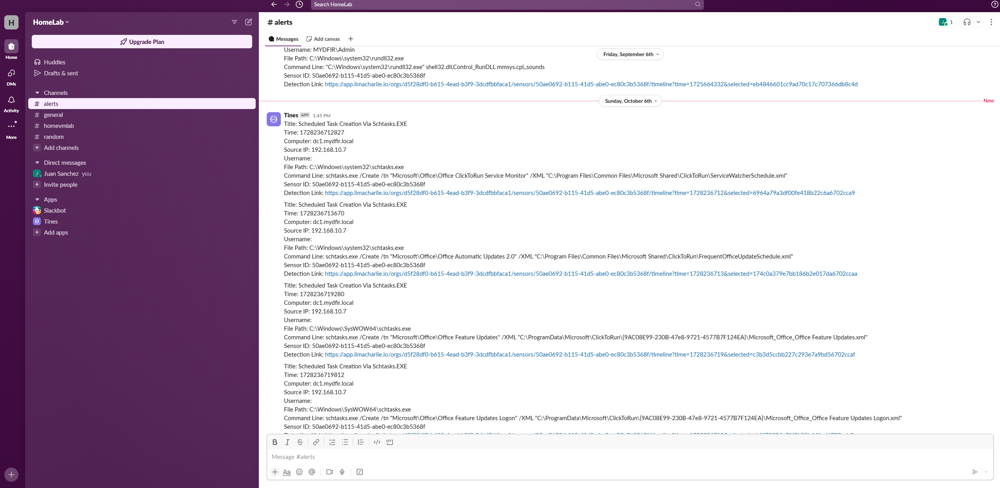

# LimaCharlie-EDR-Automation

This project showcases LimaCharlie EDR detections, automation workflows, and Slack-based alerting for a simulated enterprise network.  
The setup demonstrates how security events are detected, processed, and relayed to analysts via Slack using a fully automated decision tree.

---

## 📁 Project Structure

LimaCharlie-EDR-Automation/ 
├── README.md 
├── EdrLimaCharlie.png 
├── HomeVrTines.png 
├── SlackEDR.png 

---

## 🛠️ Tools Used

- **LimaCharlie EDR** – endpoint telemetry and real-time detection
- **Tines.io** – automation and response orchestration
- **Slack** – alert delivery and analyst interaction
- **Windows AD lab** – endpoint simulation
- **Lazagne / Scheduled Tasks** – test detection payloads

---

## ⚙️ Automation Flow Overview

### 1. **Detection**
- LimaCharlie EDR identifies suspicious events:
  - Scheduled task abuse
  - Execution of `Lazagne.exe` (credential dumping)
- Detection metadata includes:
  - File path, command line, sensor ID, and hash
- Example Alert Title:  
  `Scheduled Task Creation via Schtasks.EXE`

📸 

---

### 2. **Automation Workflow (Tines)**
- Webhook receives detection from LimaCharlie
- Workflow prompts analyst:
  - "Is this host suspicious?"
- Based on response:
  - If **Yes** → isolate sensor, notify via Slack
  - If **No** → post low-priority alert

📸 

---

### 3. **Slack Alert Output**
- Alerts posted to dedicated `#alerts` channel
- Includes:
  - Source IP, username, command line
  - Direct link to LimaCharlie timeline

📸 

---

## 📈 Highlights

- Demonstrates practical **SOAR** (Security Orchestration Automation & Response)
- Zero-touch decisioning via Tines
- Human-readable Slack notifications
- Useful in small SOC teams or homelab setups

---

## ⚠️ Disclaimer

This project was built in a private lab environment for educational and demonstration purposes only.

---
